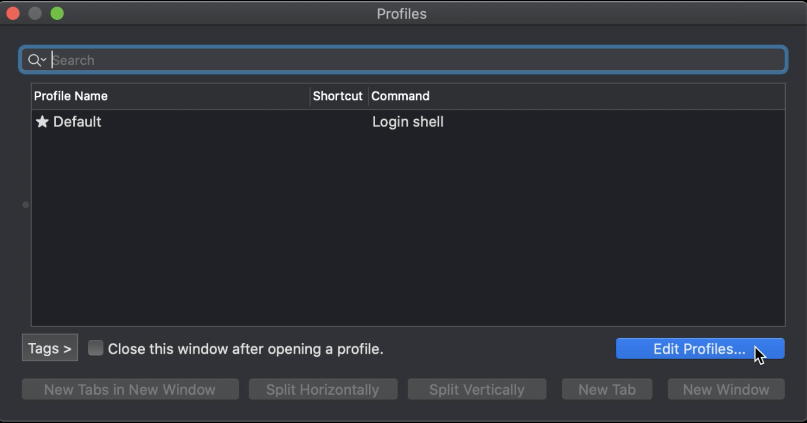
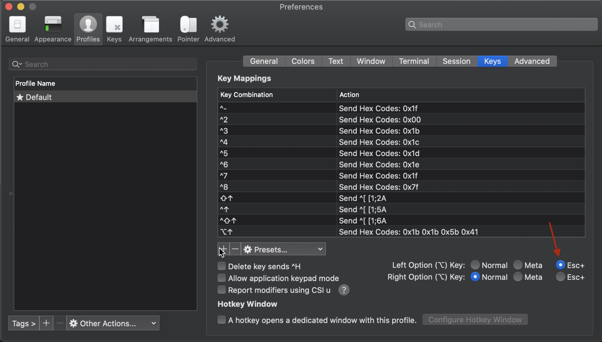
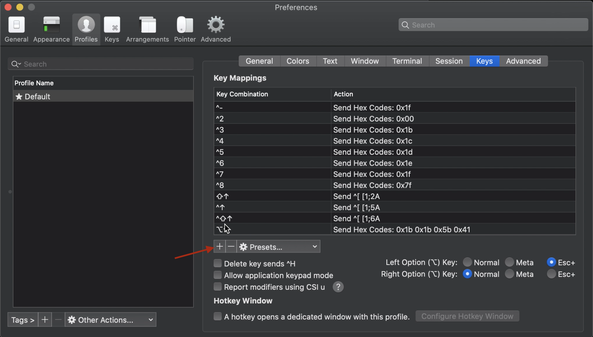
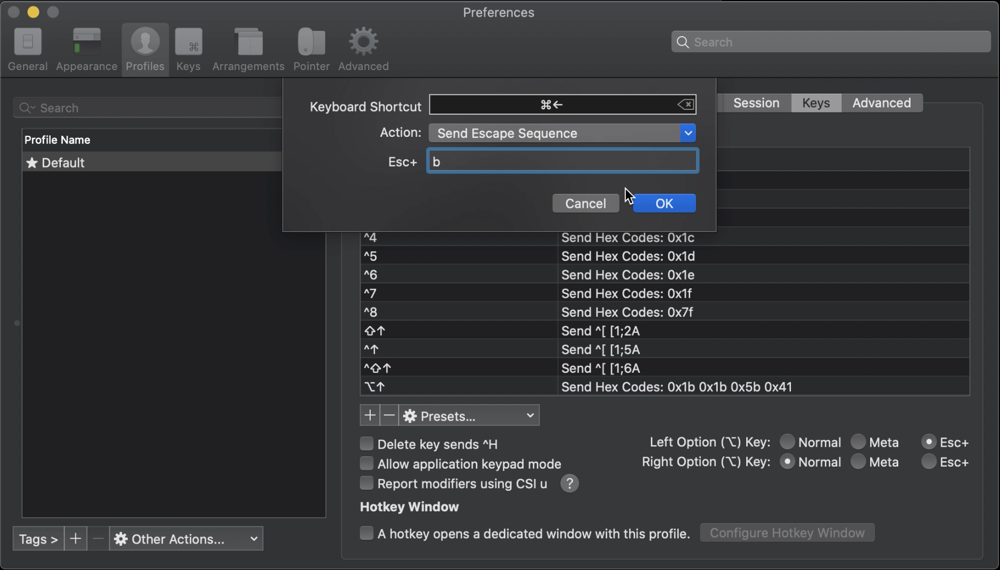

# The First 30 Minutes with Your New MacBook

A quick setup with nothing you don't need

## Chrome and its Extensions

[Download](https://www.google.com/chrome/) Chrome.

### Vimium

[Install](https://chrome.google.com/webstore/detail/vimium/dbepggeogbaibhgnhhndojpepiihcmeb?hl=en) Vimium

Vimium keeps your hands on the keyboard while browsing the web by providing keyboard shortcuts for common functions. Using keyboard shortcuts can save time and help you maintain focus.

| Command                  | Shortcut |
| ------------------------ | -------- |
| Help                     | ?        |
| Scroll Up                | j        |
| Scroll Down              | k        |
| Copy URL                 | yy       |
| Open Link in Current Tab | f        |

### Json Formatter

[Install](https://chrome.google.com/webstore/detail/json-formatter/bcjindcccaagfpapjjmafapmmgkkhgoa?hl=en) Json Formatter to save you time at the keyboard and at the optometrist.


## Xcode 

[Install](https://apps.apple.com/us/app/xcode/id497799835) Xcode to get commonly required command line tools 


## Terminal: iTerm2

[Download](https://www.iterm2.com/downloads.html) iTerm2

Replacing terminal with iTerm2 boosts your developer credibility immediately. My favorite iTerm2 features are the following

| Feature             | Description                                                  |
| ------------------- | ------------------------------------------------------------ |
| Split Pane          | Vertical and horizontal splits                               |
| Mouseless Copy      | Highlight text within iTerm2 to copy to your clipboard       |
| Custom Key Controls | Easily create custom keyboard controls to do things like skipping and deleting words! |


### Skip and Delete Words

Skipping over words as opposed to skipping characters is a significant time saver.

1. With iTerm2 open type ```⌘ + O``` to open profiles

2. Click ```Edit Profiles```

   

3. Click ```Keys```

   

4. Select ```Esc+``` for the ```Left Option Key```

   

5. Add the Skip Left Command

   1. Click the ```+```

      

   2. Click ```Click to Set```

   3. Type ```⌥ + ←```

   4. Select ```Send Escape Sequence```

   5. Type ```b``` for ```Esc+```

      

6. Add Skip Right Command (follow a similar process to 5)

   1. Click the ```+```
   2. Click ```Click to Set```
   3. Type ```⌥ + →```
   4. Select ```Send Escape Sequence```
   5. Type ```f``` for ```Esc+```


## Oh My Zsh

Installing Oh My Zsh is done in one line

```bash
sh -c "$(curl -fsSL https://raw.githubusercontent.com/ohmyzsh/ohmyzsh/master/tools/install.sh)"
```

### Set a Theme

##### 1. Open ```~/.zshrc``` in an Editor

```bash
vi ~/.zshrc
```

##### 2. Change the Default Theme

The theme ```af-magic``` is pleasant on the eyes and functionally valuable.

1. Directories are listed in a bright color
2. Dashed segments between commands are suprisingly helpful
3. Git integration is present, but not distracting

```txt
...
ZSH_THEME="af-magic" # for more themes check out https://github.com/ohmyzsh/ohmyzsh/wiki/Themes
```

##### 3. Apply the Changes

```bash
source ~/.zshrc
```

### Zsh Auto Suggestions

Zsh Auto Suggestions is like a PED for your terminal. The plugin suggests the last command that matches what you've typed. Simply hit the right arrow to accept the suggestion.

##### 1 Install the Repository

```bash
git clone https://github.com/zsh-users/zsh-autosuggestions ${ZSH_CUSTOM:-~/.oh-my-zsh/custom}/plugins/zsh-autosuggestions
```

##### 2 Add the Plugin to ```~/.zshrc```

```vim
...
plugins=(... zsh-autosuggestions)
```

##### Examples:

If plugins is blank then your line should look like

```vim
plugins=(zsh-autosuggestions)
```

If you plugins already has an entry, say git, then your line should look like

```vim
plugins=(git zsh-autosuggestions)
```


## Package Manager: Homebrew

Homebrew makes it simple to install packages e.g. jq, gnuplot etc.

#### Install Homebrew

```bash
/bin/bash -c "$(curl -fsSL https://raw.githubusercontent.com/Homebrew/install/master/install.sh)"
```

You now have the ```brew``` command available to you.


## Command Line Utilities

### JQ

```jq``` is a fantastic utility to process json. If you are proficient at scripting with ```jq```, you will be a core contributor for resolving production issues quickly.

#### Install JQ

```bash
brew install jq
```


## Editor: Visual Studio Code

It is important to have two types of IDEs, one that is slightly better than a text editor and can open files quickly, and one that let's you code in your sleep e.g. Intellij. The former is all that will be commented on in this guide.

### Install Visual Studio Code

[Download](https://code.visualstudio.com/) Visual Studio Code. 

This editor opens files quickly, doesn't throw popups in your face, and has an elaborate open source community which provides a rich set of plugins. 
